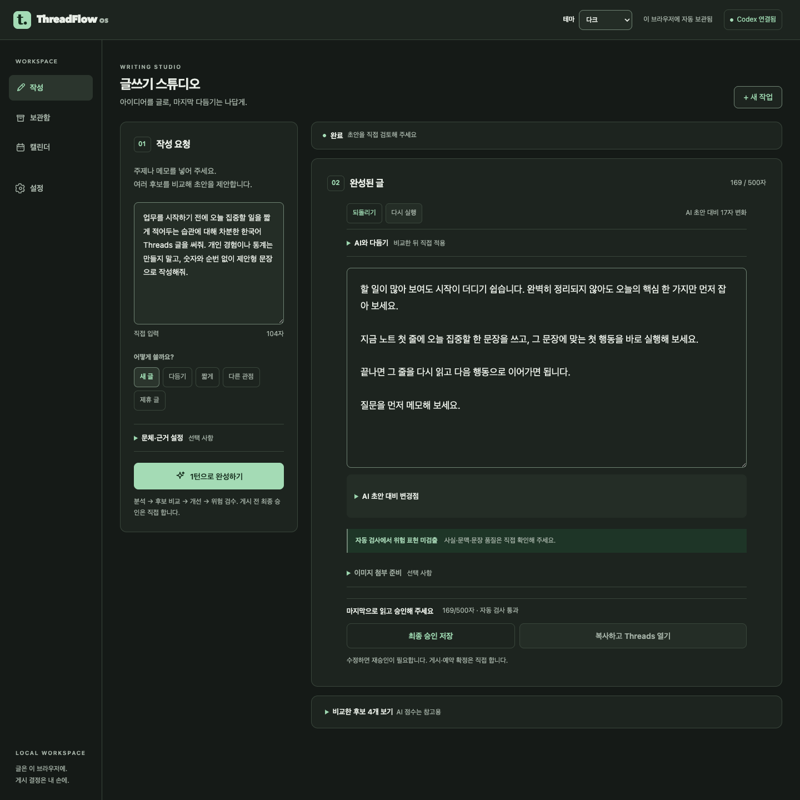

# 편의성·Forest Night 구현 검토

기준: 2026-09-07 KST · 범위: 기존 작성 기능의 정확성·편의성 개선

## 구현 결과

| 기능         | 구현 및 안전 경계                                                                                                        |
| ------------ | ------------------------------------------------------------------------------------------------------------------------ |
| 테마         | 시스템/라이트/다크, 상단·설정 동기화, 별도 localStorage, 두 앱 공통 외부 초기화 스크립트                                 |
| AI 수정      | 현재 편집본 기준 요청 → Diff 미리보기 → 적용/버리기. 적용 전 본문·승인 snapshot 불변                                     |
| 최종 작업 바 | 글자 수·검수 요약·승인·전달 한 곳. 편집 영역 640px 이하·낮은 화면, 비교/첨부 열림·입력 중에는 일반 하단 배치로 가림 방지 |
| 여러 작업    | v4 workingDrafts, 작업별 입력·문체·근거·후보·본문·이력·이미지 메타데이터 보존                                            |
| 새 작업      | 지연 저장을 먼저 완료. 실패 시 전환 중단. 문체·독자·목적 유지, 원문·근거·결과·승인 초기화                                |
| 보관함       | 전체 로컬 데이터 검색 후 20개 페이지, 작성 중/승인 완료, 이전 버전 일치 표시, 승인본 중복 표시 억제                      |
| 충돌·복구    | 작업 revision 비교로 다른 탭의 수정 덮어쓰기 금지. 내보내기에 미저장 currentRecovery 포함                                |

새 공급자·외부 계정·추가 Chrome 권한·자동 게시 기능은 추가하지 않았다. 수정 적용은 undo 한 단계이며, 승인 본문과 달라지면 전달을 다시 차단한다.

## 핵심 코드

- `packages/client-ui/src/appearance.ts`, `ThemeControl.tsx`, `public/appearance-init.js`: 테마 상태·선행 초기화.
- `RevisionPanel.tsx`, `EditorActions.tsx`: 수정 비교와 단일 승인/전달 UI.
- `draft-workspaces.ts`, `database.ts`: 구조 검증, v3→v4 이관, 순차 저장·충돌 처리.
- `library-query.ts`: 작업/승인 이력 결합, 전체 검색·상태 계산.
- `App.tsx`: 저장 후 작업 전환, 비동기 요청 잠금·작업 식별, 복구 내보내기.
- Gateway `app.ts`·`generation-manager.ts`, 공통 `RevisionRequestSchema`: 현재 본문 preview 계약. preview는 서버 최종 결과를 바꾸지 않는다.

## 검증

| 검증                                               | 결과                                                                                |
| -------------------------------------------------- | ----------------------------------------------------------------------------------- |
| 자동 테스트                                        | 22 files / **125 tests PASS**                                                       |
| 타입·린트·포맷                                     | PASS                                                                                |
| Golden                                             | **30/30 PASS** — 글 품질 보장이 아닌 결정적 검사 회귀                               |
| 웹·Extension 빌드, Extension ZIP, Companion tar.gz | PASS                                                                                |
| 실제 Codex                                         | 생성 후 후보 4개, 수정 preview 2회, 버리기/적용/undo/redo, 승인 저장 PASS           |
| 실제 웹 복원                                       | 새 작업, 검색/필터, 승인본 복원, 수정 후 재잠금, 새로고침 PASS                      |
| 실제 두 탭 충돌                                    | WORKSPACE_CONFLICT, 전환 차단, 승자 저장본 유지, 패자 currentRecovery 내보내기 PASS |
| DB 테스트                                          | v3 이관·실패 rollback/재열기·손상 원본 보존·quota·저장 직렬화·Export·전체 삭제 PASS |
| 첫 화면                                            | 앱 JS를 보류한 production 웹·Extension 모두 저장 선호 적용, React 시작 후 반전 없음 |
| 화면 폭                                            | 웹 작성 340/390/1024/1440px, Extension 번들 340/520px, 두 테마 넘침 없음            |
| 접근성 보조 검사                                   | Tab 포커스, 비교 열림 시 고정 해제, 긴 위험 문구·초과 글자 차단 확인                |

실제 첫 생성은 `PROVIDER_UNAVAILABLE`로 실패했고 입력은 보존되었다. 한 차례 재시도는 성공했다. 내부 원인·재현율은 확정하지 않았으며 상시 연결 성공을 보장하지 않는다.

테스트는 분리된 브라우저 프로필에서 수행했다. 실제 Threads 작성창 전달·게시, 네이티브 Extension 설치·Chrome 권한/로그인 동작은 수행하지 않았다. Extension 검증은 **production 번들 + 모의 Chrome API**이다.

## 데이터 업그레이드와 복구

- v3의 `workspaceStates/current`를 v4 작업으로 이관한다. 승인 버전·게시 URL·연결 키는 유지하며, 이전 snapshot은 복구용 백업으로 남긴다.
- 이후 활성 작업은 `settings.activeWorkingDraft`가 가리키는 `workingDrafts` 하나가 원천이다. 구형 current 행에 새 작업을 이중 저장하지 않는다.
- 손상된 snapshot은 자동 초기화하지 않는다. 설정에서 내보내기로 원본을 보관한다.
- 충돌 시 다른 탭을 닫고 **먼저 내보내기 → 새로고침**한다. 내보내기 파일의 `currentRecovery`에 미저장 본문이 있으므로 수동 복원할 수 있다. 자동 JSON 가져오기 기능은 없다.
- Export는 DB 읽기 transaction으로 저장본을 읽고, 연결 키를 제외한다. 현재 편집본 복구 사본과 테마 선호도도 포함한다.
- 웹·Extension의 Origin은 다르므로 데이터와 테마를 자동 동기화하지 않는다. 구형 앱과 새 앱을 같은 Origin에서 동시에 사용하지 않는 것을 권장한다.

## 남겨 둔 수동 검증

- 실제 모바일 소프트 키보드와 브라우저 자체 확대.
- 실브라우저 전체 삭제 버튼: 데이터 삭제 위험으로 보안 승인 차단, 사용자 승인 대기. DB 전체 삭제·테마 초기화는 각각 자동 테스트 PASS.
- 네이티브 Side Panel 설치/닫기·재열기, 로그인된 Threads DOM 전달.
- 신규 Mac 설치, 사람에 의한 글 품질 평가.

200% CSS 확대는 브라우저 자체 확대나 실제 모바일 키보드 검증을 대신하지 않는다. 최신 설치물 hash는 [출시 준비 상태](release-readiness.md), 단계별 기록은 [개발 계획](../dev-plan/implement_20260906_225905.md)에 있다.

## 시각 회귀 재실행

격리된 테스트 프로필의 작성 화면에 완성된 글을 준비한 뒤 저장소 루트에서 Playwright CLI의 `run-code --filename scripts/qa/editor-actions-layout.js`를 실행한다. 두 테마·네 가지 폭·확대 상태에서 버튼 개수/가로 넘침뿐 아니라 summary 실제 클릭과 Tab 포커스를 확인한다. DOM에 요소가 있다는 것만으로 클릭 가능 판정을 하지 않는다.

