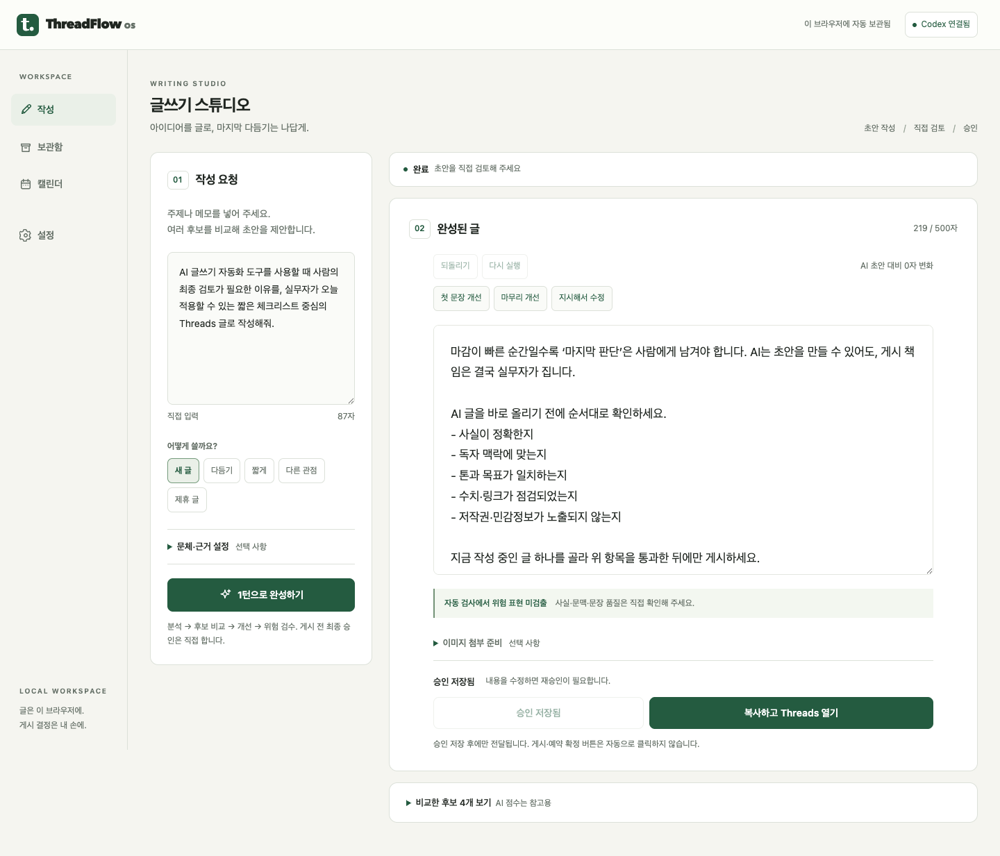

# 에디토리얼 스튜디오 디자인

작성: 2026-09-06 · 기존 기능의 정확성과 사용성 개선, 기능 확장 아님

## 제안과 결정

**작성을 위한 작업공간**으로 전환한다. 기존 세이지·포리스트 브랜드는 유지하되 홍보 영역, 장식 그라디언트, 과도한 카드 그림자를 제거한다. 대시보드형 통계나 랜딩페이지형 섹션은 추가하지 않는다.

| 항목      | 기존 문제                                 | 적용 방향                                  |
| --------- | ----------------------------------------- | ------------------------------------------ |
| 웹 구조   | 홍보 영역과 520px 패널이 화면 대부분 차지 | 184px 탐색 + 유연한 작업공간               |
| 작성 흐름 | 입력 아래로 결과가 멀리 밀림              | 320px 요청 패널과 넓은 편집 패널 병렬 배치 |
| 위계      | 작은 글씨와 비슷한 카드 강조              | 본문 편집 최우선, 후보·이미지 정보 접기    |
| 신뢰      | 단계 수를 진행률처럼 표시                 | 실제 이벤트 단계와 취소 동작만 표시        |
| 승인      | 검사 통과와 글 품질 보장이 혼동됨         | 자동 검사 한계 명시, 최종 사용자 승인 유지 |

## 시각 시스템

- 배경 `#F5F5F0`, 표면 `#FFFFFF`, 본문 `#202621`, 보조 글자 `#657067`, 강조 `#245B40`.
- 시스템 한국어 글꼴 사용. 외부 폰트 요청·새 의존성 없음.
- 일반 UI 14px, 본문·상태 보조 12px 이상 (영문 분류 레이블은 10px), 편집 본문 17px / 줄높이 1.75, 페이지 제목 24px.
- 간격 4/8/12/16/24/32px, 모서리 8–12px, 얇은 경계선. 큰 그림자·글로우 없음.
- 키보드 포커스 외곽선, 선택 모드 `aria-pressed`, 이름 있는 입력과 알림 닫기 버튼.

## 화면과 반응형

- 웹 1200px 이상: 상단 72px, 좌측 탐색 184px, 요청 320px, 결과는 남은 폭. 본문 최대 읽기 폭 720px.
- 웹 960–1199px: 탐색은 수평으로 전환, 요청·결과 병렬 유지.
- 웹 960px 미만: 입력 → 생성 상태 → 결과 → 후보의 한 열 흐름. 가로 스크롤 금지.
- Extension: 뷰포트 크기와 무관하게 공통 UI의 한 열 구성 유지. 340px에서 확인.
- 웹·Extension의 보관함/캘린더/설정도 동일 토큰을 사용한다.

## 상태와 안전 경계

- 빈 결과는 간결한 안내만 제공하며 가짜 초안·품질 점수·성과 지표를 보여주지 않는다.
- 생성 중에는 실제 SSE 단계, 취소 버튼과 실패 메시지를 표시한다. 추정 퍼센트 없음.
- 저장 표시는 IndexedDB 저장 성공/실패와 연결한다. 승인 저장과 자동 작업 보관은 별개다.
- 편집, 후보 선택, 부분 수정은 기존 이력/위험 검사/승인 무효화 규칙을 그대로 따른다.
- 후보는 편집 결과 뒤의 접힘 패널. 위험 경고와 승인 액션은 접지 않는다.
- 이미지는 실제 전송 기능이 아니라 첨부 준비용 메타데이터임을 명시한다.
- 웹은 승인 글을 복사하고 Threads를 열 뿐 자동 입력/게시하지 않는다. Extension의 자동 입력도 Threads 로그인·DOM 확인이 필요하다.
- 생성 완료 자동 스크롤은 작은 화면/Extension에만 적용해 데스크톱 위치 점프를 방지한다.

## 검증 기준

1440px·1024px·390px·340px 실제 Chromium 렌더, 가로 넘침, 편집 폭, 접힘 설정, 실패/진행 상태, 승인 전 전달 차단, 편집 후 승인 무효화, 새로고침 보관, 웹·Extension production build를 확인한다. Threads 실계정 게시 및 Extension 로그인 DOM 검증은 별도 외부 Gate로 유지한다.

## 적용 결과 — 2026-09-06

- 웹 1440px 실측: 탐색 184px, 요청 320px, 결과 패널 848px, 편집 입력 폭 720px.
- 웹 1024px 실측: 수평 탐색, 요청 320px, 결과 616px.
- 웹 390px/340px: 요청·결과 각각 366px/316px 한 열, 가로 넘침 없음.
- Extension production 번들 340px/520px: 한 열과 캡처 버튼 렌더 확인. Chrome API는 모의 주입했으며 실제 설치·Threads 로그인 DOM 검증과 구분한다.
- UI 회귀 9개를 추가했고 전체 94개 테스트, 타입·린트·웹/확장 빌드, Golden 30개 통과.
- 실제 Codex 재시도 결과 후보 4개, 222자 초안을 편집해 219자로 승인 저장. 수정 후 전달 차단, 되돌리기, 보관함과 새로고침 복구 확인. 실제 Threads 전달·게시 미실행.
- 최초 LLM 생성은 구조화 출력 검증 실패로 종료됐다. 입력 보존과 오류 표시를 확인했고 재시도는 성공했다. 생성 성공률이나 문장 품질 보장으로 해석하지 않는다.
- 숫자 검사는 체크리스트의 `1개/5개`에도 경고하는 기존 보수적 규칙이다. 이번 디자인 변경에서 검사 기준을 완화하지 않았다.

아래는 AI 시안이 아니라 **실제 적용 화면**이다. 합성 QA 주제로 생성하고 직접 편집한 초안이며 실제 게시하지 않았다.

## 2026-09-07 후속 적용

Forest Night와 편의 기능을 구현했다. 앞선 수치는 이전 리디자인의 기준선이며, 최신 결과는 **125개 테스트 PASS**와 [편의성·테마 검토](convenience-theme-review.md)를 기준으로 한다. 확장 번들 렌더 QA와 실제 네이티브 설치 QA는 구분한다.
